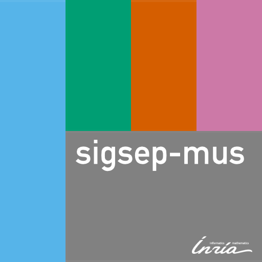

# About me

 Since 2018, I am a postdoctoral researcher at the [Scientic Data Management team (Zenith)](http://www-sop.inria.fr/teams/zenith/pmwiki/pmwiki.php/Main/HomePage) at Inria in Montpellier, France. I did my Ph.D (Dr.-Ing.) at the [International Audio Laboratories Erlangen](https://www.audiolabs-erlangen.de/) (is a joint institution of [Fraunhofer IIS](https://www.iis.fraunhofer.de) and [FAU Erlangen-Nürnberg](https://fau.de)) in Germany supervised by [Bernd Edler](https://www.audiolabs-erlangen.de/fau/professor/edler). My dissertation titled __«Separation and Count Estimation for Audio Sources Overlapping in Time and Frequency»__ can be viewed [<i class="fas fa-file-pdf"></i> here](https://opus4.kobv.de/opus4-fau/frontdoor/index/index/docId/13114). Before, I graduated in electrical engineering / communication engineering from the [University of Hannover, Germany](https://www.uni-hannover.de). An extended CV is available [<i class="fas fa-file-pdf"></i> here](./stoeter_cv.pdf).
<!-- Outside of my time [analog photography], [analog synthesizers].  -->

## Current Research Interests

- __Deep learning on data hubs__: I am interested multi-modal auto-encoders that can learn the relations between the different modalities to reconstruct or enhance missing or degraded data. Also, I work on multistore and heterogeneous heritage datasets.

- __User-centered AI for audio data__: I want to develop new methods and tools for users with domain knowledge to deliver interpretable audio models. Furthermore, _evaluation_ of audio processing tasks is often done in a computational manner, due to the lack of expertise from signal processing researchers in organizing perceptual evaluation campaigns.

- __Ecological machine-learning__: I want to play a role in reducing the carbon footprint of my work. Reducing the size of datasets speeds up training and therefore saves energy. Reducing the computational complexity of models is an active research topic, with strongly investigated ideas like quantization, pruning or compression. Inspired by current trends in differentiable signal processing, I want to convert deep models so that they can be deployed on edge devices.

# Scientific Service

## Student Supervision

- Lucas Mathieu, Research Internship (Master), (AgroParisTech, France) <Badge text="Ongoing" type="success"/>
<!-- add UM project here -->
- [Wolfgang Mack](https://www.audiolabs-erlangen.de/fau/assistant/mack), Master Thesis (FAU Erlangen-Nürnberg, Germany)
- Erik Johnson, [DAAD](https://www.daad.de/rise/en/)rsearch internship (Carleton University, Canada)
- [Nils Werner](https://nils-werner.github.io/), Master Thesis, (FAU Erlangen-Nürnberg, Germany)
- Jeremy Hunt,  [DAAD](https://www.daad.de/rise/en/) research internship, (Rice University, USA)
- Ercan Berkan, Master Thesis, (Bilkent University, Turkey)  
- Shujie Guo, Research Internship, (FAU Erlangen-Nürnberg, Germany)
- [Aravindh Krishnamoorty](https://www.idc.tf.fau.de/person/aravindh-krishnamoorthy), Internship
- Bufei Liu, Research Internship (Shanghai University, China)
<!-- - Qiao Wang -->

## Reviewing

* __Journals:__ IEEE [Transaction in Audio, Speech and Language Processing](https://ieeexplore.ieee.org/xpl/RecentIssue.jsp?punumber=6570655), [Signal Processing Letters](https://ieeexplore.ieee.org/xpl/RecentIssue.jsp?punumber=97), [EURASIP](https://www.eurasip.org/), [Journal of Open Source Software](https://github.com/search?q=repo%3Aopenjournals%2Fjoss-reviews+label%3Areview+assignee%3Afaroit&type=Issues&ref=advsearch&l=&l=)
* __Conferences:__ [ICASSP](http://ieeeicassp.org/), [EUSIPCO](https://eusipco2020.org/), [DAFx](https://www.dafx.de/), [ISMIR](https://www.ismir.net).

## Teaching

### Graduate Programs

* __2020__: [Research Internship](https://www.polytech.umontpellier.fr/partenariats/stages-et-projets) (Master, Stage 5), PolyTech Montpellier
* __2018, 2019__: Introduction to Deep Learning, Master 2, PolyTech Montpellier
* __2016__: [Reproducible Audio Research Seminar](https://github.com/audiolabs/APSRR-2016), University of Erlangen (Germany)
* __2014-2016__: Multimedia Programming , Highschool Students, University of Erlangen (Germany)
* __2013-2016__: Lab Course, _Statistical Methods for Audio Experiments_, Master Students, University of Erlangen (Germany) [<i class="fas fa-file-pdf"></i> Course Material](https://www.audiolabs-erlangen.de/content/05-fau/professor/00-mueller/02-teaching/2016s_apl/LabCourse_StatsMethods.pdf).

### Talks

* __2020__: Invited talk at AES Symposium ["AES Virtual Symposium: Applications of Machine Learning in Audio"](https://www.aes.org/events/2020/learning/) titled "Current Trends in Audio Source Separation". [Slides]<Badge text="t.b.a." type="info"/> [Video]<Badge text="t.b.a." type="info"/>
* __2019__: Invited talk at a conference [“Deep learning: From theory to applications”](https://www.lebesgue.fr/content/sem2018-deeplearning) titled “Deep learning for music unmixing”. [Video](https://www.lebesgue.fr/video/2879) [Slides]()
* __2019__: Tutorial at [EUSIPCO 2019](http://eusipco2019.org/): _"Deep learning for music separation"_. <a href="https://sigsep.github.io/tutorials/"><i class="fad fa-presentation"></i> Slides</a> <a href="https://sigsep.github.io/tutorials/"><i class="fad fa-browser"></i> Website</a>
* __2018__: Tutorial at [ISMIR 2019](http://ismir2018.ircam.fr/pages/events-tutorial-01.html): _"Music Separation with DNNs: Making It Work"_. <a href="https://sigsep.github.io/tutorials/"><i class="fad fa-presentation"></i> Slides</a> <a href="https://sigsep.github.io/tutorials/"><i class="fad fa-browser"></i> Website</a>

### Other Ressources

* [sigsep.io](https://sigsep.github.io) - Open ressources for music separation.
* [awesome-scientific-python-audio](https://github.com/faroit/awesome-python-scientific-audio) -  Curated list of python packages for scientific research in audio.

# Software

##  open-unmix <a href="https://devpost.com/software/open-unmix"><Badge text="Winner: Pytorch Global Hackathon 2019" type="success"/></a>

<iframe width="100%" height="300rem" src="https://www.youtube-nocookie.com/embed/IxLnoy-GzqI" frameborder="0" allow="accelerometer; autoplay; encrypted-media; gyroscope; picture-in-picture" class="" allowfullscreen></iframe>

Open-Unmix, a deep neural network reference implementation ([PyTorch](https://github.com/sigsep/open-unmix-pytorch) and [NNabla](https://github.com/sigsep/open-unmix-nnabla)) for music source separation, applicable for researchers, audio engineers and artists. Open-Unmix provides ready-to-use models that allow users to separate pop music into four stems: vocals, drums, bass and the remaining other instruments. 

Demo Separations on [MUSDB18](https://sigsep.github.io/musdb) Dataset:

<iframe width="100%" height="490rem" src="https://d2cowzs755i94n.cloudfront.net" frameborder="0" allow="accelerometer; autoplay; encrypted-media; gyroscope; picture-in-picture" class="" allowfullscreen></iframe>

<a class="button" href="https://sigsep.github.io/open-unmix/"><i class="fad fa-browser"></i> Website/Demo</a>
<a class="button" href="https://github.com/sigsep/open-unmix-pytorch"><i class="fab fa-github"></i> Code</a>
<a class="button" href="https://joss.theoj.org/papers/10.21105/joss.01667"><i class="fad fa-file-pdf"></i> Paper</a>
<a class="button" href="https://anr.fr/fr/actualites-de-lanr/details/news/open-unmix-un-logiciel-open-source-issu-du-projet-anr-kamoulox-pour-demixer-la-musique/"><i class="fad fa-browser"></i> ANR Blog (french)</a>
<a class="button" href="https://devpost.com/software/open-unmix"><i class="fad fa-rocket-launch"></i> Pytorch Hackathon</a>


## CountNet

<video width="100%" controls>
  <source src="https://www.audiolabs-erlangen.de/content/resources/00-2017-CountNet/rnn_demo.mp4" type="video/mp4">
  Your browser does not support the video tag.
</video>

CountNet is a deep learning model that estimates the number of concurrent speakers from single channel speech mixtures. This task is a mandatory first step to address any realistic “cocktail-party” scenario. It has various audio-based applications such as blind source separation, speaker diarisation, and audio surveillance. 

<a class="button" href="https://github.com/faroit/countnet"><i class="fab fa-github"></i> code</a> 

## <i class="fab fa-python"></i> musdb + museval

A python package to parse and process the [MUSDB18 dataset](https://sigsep.github.io/musdb), the largest open access dataset for music source separation. The tool was originally developed for the [Music Separation task](sisec18.unmix.app) as part of the [Signal Separation Evaluation Campaign (SISEC)](https://sisec.inria.fr/). 

Using `musdb` users can quickly iterate over multi-track music datasets. In just three lines of code a subset of the MUSDB18 is automatically downloaded and can be parsed:

```python
import musdb
mus = musdb.DB(download=True)
for track in mus:
    train(track.audio, track.targets['vocals'].audio)
```

Now, given a trained model, evaluation can simply be performed using __museval__

```python
import museval
for track in mus:
    estimates = predict(track)  # model outputs dict
    scores = museval.eval_mus_track(track, estimates)
    print(scores)
```

<a class="button" href="https://github.com/sigsep/sigsep-mus-db"><i class="fab fa-github"></i> musdb</a> 
<a class="button" href="https://github.com/sigsep/sigsep-mus-eval"><i class="fab fa-github"></i> museval</a>

## Hack

### `git wig` <Badge text="Winner" type="success"/>
__Event__: 2015 Midi-Hackday Berlin,
__Collaborators__: [Nils Werner](https://nils-werner.github.io/), [Patricio-Lopez Serrano](https://www.audiolabs-erlangen.de/fau/assistant/lopez)


Why can't we have version on control for making music? In this hack, we merged `git` with a terminal based music sequencer, calling it `git wig`. We also created a suitable, diffable sequencer format to compose music. Finally, we realized `git push` by bringing this feature into a hardware controller.

<a class="button" href="https://github.com/RocketScienceAbteilung/git-grid"><i class="fab fa-github"></i> git grid</a>
<a class="button" href="https://github.com/RocketScienceAbteilung/git-wig"><i class="fab fa-github"></i> git wig</a>

### DeepFandom <Badge text="1st Place" type="success"/> 
__Event:__ 2016 Music Hackday Berlin. 
__Collaborators__: [Patricio-Lopez Serrano](https://www.audiolabs-erlangen.de/fau/assistant/lopez)

<iframe width="100%" height="300rem" src="https://www.youtube-nocookie.com/embed/uPb56-UfFRI" frameborder="0" allow="accelerometer; autoplay; encrypted-media; gyroscope; picture-in-picture" allowfullscreen></iframe>

DeepFandom is a deep learning model that learns the [Soundcloud](soundcloud.com) comments and predicts what _YOUR_ track could get as comments and where they are positioned on the waveform. 

<a class="button" href="https://devpost.com/software/deep-fandom"><i class="fad fa-browser"></i> Website</a>

### Magiclock 

<!--  -->


Magiclock is an macOS application that uses haptic feedback (also called Taptic Engine™) to let you __feel__ the MIDI clock beat from your Magic Trackpad.

<a class="button" href="https://github.com/faroit/magiclock"><i class="fab fa-github"></i> Code</a>
## Other Software Contributions

* <i class="fab fa-python"></i> [stempeg](https://github.com/faroit/stempeg) - read/write of STEMS multistream audio.
* <i class="fab fa-js"></i> <a href="https://github.com/audiolabs/trackswitch.js/">trackswitch.js</a> - A Versatile Web-Based Audio Player for Presenting Scientifc Results.
* <i class="fab fa-js"></i> <a href="https://github.com/audiolabs/webMUSHRA">webMUSHRA</a> - MUSHRA compliant web audio API based experiment software.
* <i class="fab fa-python"></i> <a href="https://github.com/sigsep/norbert">norbert</a> - Painless Wiener filters for audio separation.

# Datasets

##   MUSDB18


The _musdb18_ is a dataset of 150 full lengths music tracks (~10h duration) of different genres along with their isolated drums, bass, vocals and others stems. It is currently the largest, publicly available dataset used for music separation. _MUSDB18_ serves as a benchmark for music separation tasks.
 
 <a class="button" href="https://sigsep.github.io/datasets/musdb.html"><i class="fad fa-browser"></i> Website</a>
<a class="button" href="https://paperswithcode.com/search?q_meta=&q=musdb18
"><i class="fad fa-browser"></i> Paperswithcode</a>

## LibriCount


The dataset contains a simulated cocktail party environment of [0..10] speakers, mixed with 0dB SNR from random utterances of different speakers from the LibriSpeech `CleanTest` dataset.
All recordings are of 5s durations, and all speakers are active for the most part of the recording. For each unique recording, we provide the audio wave file (16bits, 16kHz, mono) and an annotation `json` file with the same name as the recording.

<a class="button" href="https://denumerate.app"><i class="fad fa-browser"></i> Listening Experiment</a>
<a class="button" href="https://zenodo.org/record/1216072"><i class="fad fa-browser"></i> Download</a>

## Muserc

<iframe width="100%" height="300rem" src="https://www.youtube-nocookie.com/embed/yOKvqz2jZgM" frameborder="0" allow="accelerometer; autoplay; encrypted-media; gyroscope; picture-in-picture" class="" allowfullscreen></iframe>

A novel dataset for musical instruments where we recorded a __violin cello__ that includes sensor recordings capturing the finger position on the fingerboard which is converted into an instantaneous frequency estimate. We also included professional high-speed video camera data to capture excitations from the string at 2000 fps. All of the data is sample synchronized

<a class="button" href="https://www.audiolabs-erlangen.com/resources/muserc"><i class="fad fa-browser"></i> Website</a>
<a class="button" href="https://zenodo.org/record/1560651"><i class="fad fa-browser"></i> Download</a>

# Publications

<a class="button" href="https://scholar.google.com/citations?user=7HsSdqwAAAAJ&hl=en"><i class="fas fa-graduation-cap"></i> Google Scholar</a> <a class="button" href="https://www.zotero.org/faroit"><i class="fas fa-graduation-cap"></i> Zotero</a>


## Peer-Reviewed Journals

<publications zotero_id="6408178" filter="itemType=journalArticle"></publications>

## Peer-Reviewed Conferences

<publications zotero_id="6408178" filter="itemType=conferencePaper"></publications>
